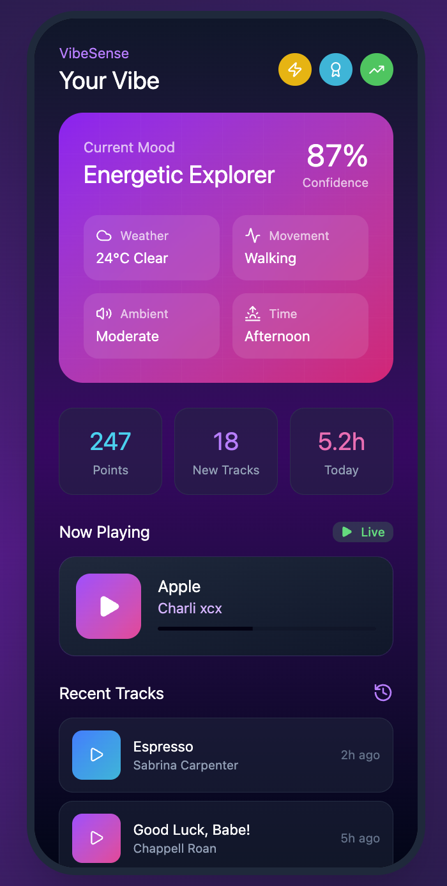
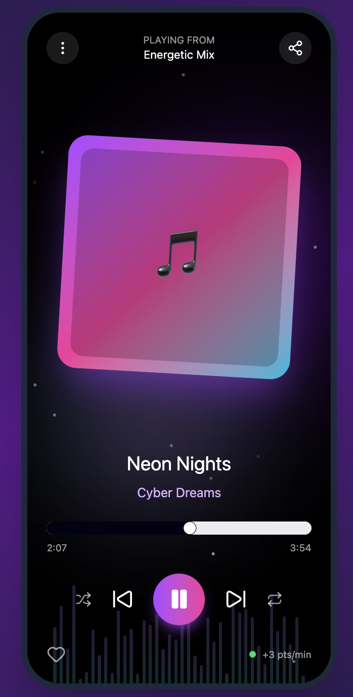
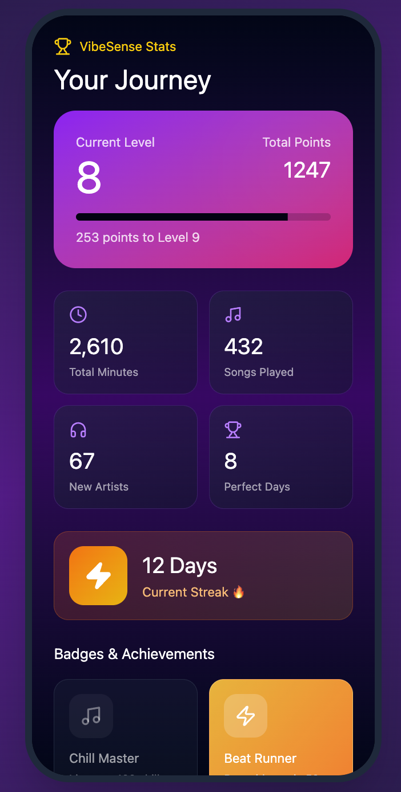

# 🎧 VibeSense – The Music Mood Player
> **VibeSense** is an Android app that adapts music to your current mood using your phone’s sensors and environment.  
> Developed by **Arthur Horeanu** and **Alexia Voina** as part of a university project for *Programming for Mobile Devices*.

---

## 🚀 Overview
**VibeSense** automatically detects the user’s state through phone sensors and external data, then selects the most suitable music playlist.  
The app personalizes listening experiences and rewards users with points and achievements for their engagement.

Users can:
- 📱 Detect their **activity level** (walking, running, idle) via sensors.
- ☀️ Adapt playlists to **time of day, light, and weather**.
- 🔊 React to **ambient noise** levels (quiet vs. crowded).
- 🏆 Earn **points and badges** for listening and discovering new songs.
- 🔔 Receive **contextual notifications** suggesting moods or playlists.

---

## 🎨 Mockups
*(App concept and design developed in Figma – Android Material 3)*

  
  
  

---

## ⚙️ Core Features
| Feature | Description |
|----------|--------------|
| **Mood Detection via Sensors** | Detects user’s physical state through accelerometer, light sensor, and microphone. |
| **Weather & Time Adaptation** | Syncs with weather APIs and time-of-day to match the playlist mood. |
| **Music Platform Integration** | Connects to Spotify or YouTube for streaming playback. |
| **Gamification System** | Awards points and badges like *Chill Master*, *Beat Runner*, *Night Owl*. |
| **Contextual Notifications** | Suggests playlists based on mood, location, or weather. |

---

## 🧩 Architecture
**Pattern:** MVVM (Model–View–ViewModel)

- **Model:** Firebase Firestore + Room (local caching)
- **ViewModel:** Data logic, synchronization, and mood inference
- **View:** Android Jetpack Compose UI

**Main Technologies:**  
Kotlin · Android Studio · Firebase · Firestore · Room · LiveData/Flow · Coroutines · Sensors API · Material Design 3

---

## 🗂️ Project Roadmap (Gantt Summary)
| Week | Focus | Key Tasks |
|------|--------|-----------|
| 1 | **Setup** | Project structure, GitHub repo, UI sketches, architecture planning |
| 2 | **UI/UX Design** | Layouts for Start, Player, Settings, Dashboard |
| 3 | **Sensor Integration** | Accelerometer, Light, Microphone |
| 4 | **Mood Logic** | Data processing and activity detection |
| 5 | **API Integration** | Spotify / YouTube / Weather |
| 6 | **Notifications & Gamification** | Push alerts and reward system |
| 7 | **Realtime Adaptation** | Live mood updates and Room DB setup |
| 8 | **Design Polishing** | Animations, visualizer, responsive UI |
| 9 | **Testing & Optimization** | Performance tests, energy usage checks |
| 10 | **Documentation** | Final code review, report, presentation prep |

---

## 🔒 Data & Security
- 🔐 **Firebase Authentication** (planned for user profiles)
- ☁️ **Firestore security rules** for user data
- 🔏 Sensitive data (`google-services.json`) excluded from GitHub
- 🧱 Local data encrypted using Room

---

## 🧠 Credits
This project was developed for the *Programming for Mobile Devices* course,  
as part of the **Computer Science in German** specialization at the  
**Faculty of Mathematics and Computer Science**,  
**Babeș-Bolyai University, Cluj-Napoca**.

Team name: **Bookstreet** (student project group)  
Developers: **Arthur Horeanu** & **Alexia Voina**