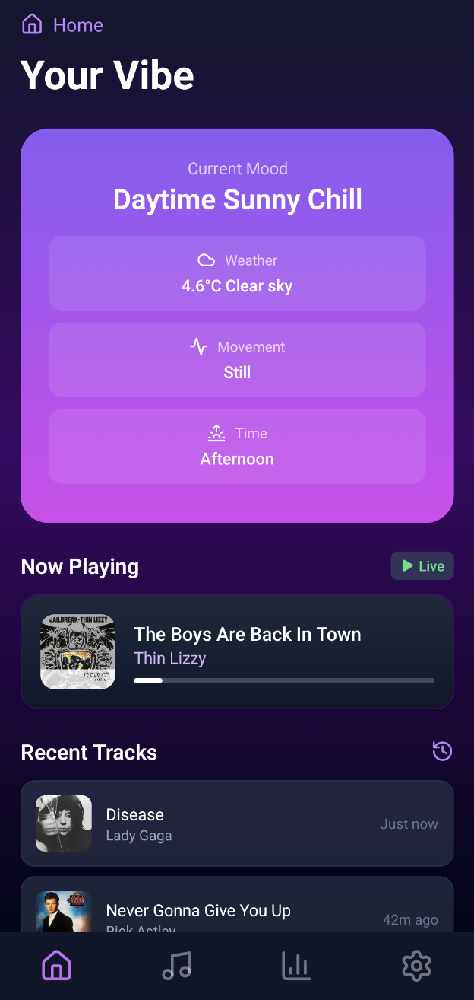
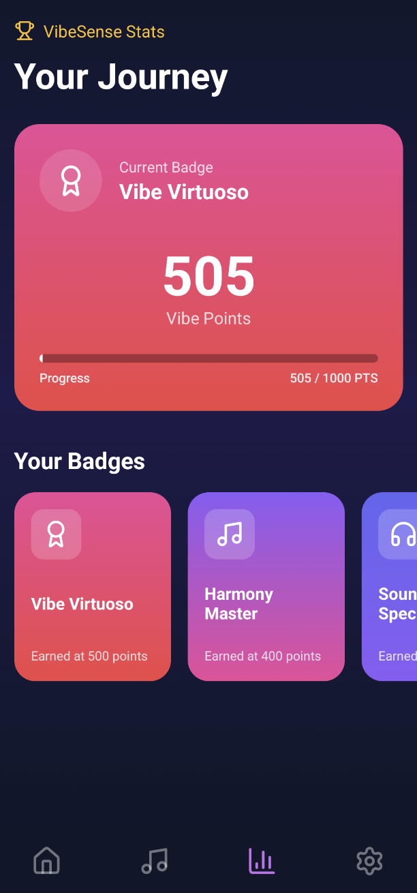

# 🎧 VibeSense – The Music Mood Player
> **VibeSense** is a mobile app that adapts music to your current mood using your phone’s sensors and environment.  
> Developed by **Arthur Horeanu** and **Alexia Voina** as part of a university project for *Programming for Mobile Devices*.

---

## 🚀 Overview
**VibeSense** automatically detects the user’s state through phone sensors and external data, then selects the most suitable music playlist.  
The app personalizes listening experiences and rewards users with points and achievements for their engagement.

Users can:
- 📱 Detect their **activity level** (walking, running, still) via sensors.
- ☀️ Adapt playlists to **time of day and weather**.
- 🏆 Earn **points and badges** for listening to music.
- 🔔 Receive **notifications** three times per day.

---

## 🎨 Mockups
*(App concept and design developed in Figma)*

  
  
  

---

## ⚙️ Core Features
| Feature | Description |
|----------|--------------|
| **Mood Detection via Sensors** | Detects user’s physical state through accelerometer. |
| **Weather & Time Adaptation** | Syncs with weather APIs and time-of-day to match the playlist mood. |
| **Music Platform Integration** | Connects to Spotify for streaming playback. |
| **Gamification System** | Awards points and badges like *Fresh Viber*, *Vibe Explorer*, *Legendary Vibesmith* etc. |
| **Contextual Notifications** | Time-based notifications (3x/day). |

---

## 🧩 Architecture
**Pattern:** Client-Server

- **Client (Frontend):** A React Native (with Expo) mobile application that handles the user interface and user interactions.
    - **UI:** Component-based architecture, built with React Native.
    - **State Management:** React Hooks (`useState`, `useEffect`) and Context API (`MoodContext`).
- **Server (Backend):** A Kotlin application that exposes a REST API for the frontend.
    - **Logic:** Manages business logic, data processing, and mood inference based on context from the client (location, activity, time).

**Main Technologies:**
*   **Frontend:** TypeScript, React Native, Expo
*   **Backend:** Kotlin, Ktor

---

## 🗂️ Project Roadmap (Gantt Summary)
| Week | Focus | Key Tasks |
|------|--------|-----------|
| **1 (Oct 20–26)** | **Project Initialization & Setup** | Set up development environment (Android Studio, GitHub), project structure, UI sketches, architecture planning |
| **2 (Oct 27 – Nov 2)** | **UI/UX Design (Prototyping)** | Create main layouts (Start Screen, Player, Settings, Mood Dashboard), define color & theme concept |
| **3 (Nov 3–9)** | **Authentication & Firebase Setup** | Configure Firebase project, app connection, implement login / registration / logout, store users in Firestore |
| **4 (Nov 10–16)** | **Sensor Integration (Acceleration)** + **External API Integration (Spotify / Weather)** | Integrate sensor APIs, first data collection for activity detection (walking, running) + Connect to streaming and weather APIs |
| **5 (Nov 17–23)** | **Data Processing & Mood Logic (V1)** | Develop Mood Engine: detect weather, activity level, and time of day |
| **6 (Nov 24–30)** | **Notifications (V2)** | Implement push notifications |
| **7 (Dec 1–7)** | **Gamification (V3)** | Points system, badges, progress display |
| **9 (Dec 8–21)** | **Internal Testing** | Test on multiple devices |
| **10 (Dec 22 – Jan 4)** | **Development Phase Closure & Documentation** | Technical documentation |

---

## 🔒 Data & Security
- 🔐 **Firebase Authentication** (planned for user profiles)
- ☁️ **Firestore security rules** for user data
- 🔏 Sensitive data (`google-services.json`) excluded from GitHub

---

## 🧠 Credits
This project was developed for the *Programming for Mobile Devices* course,  
as part of the **Computer Science in German** specialization at the  
**Faculty of Mathematics and Computer Science**,  
**Babeș-Bolyai University, Cluj-Napoca**.

Team name: **Bookstreet** (student project group)  
Developers: **Arthur Horeanu** & **Alexia Voina**
